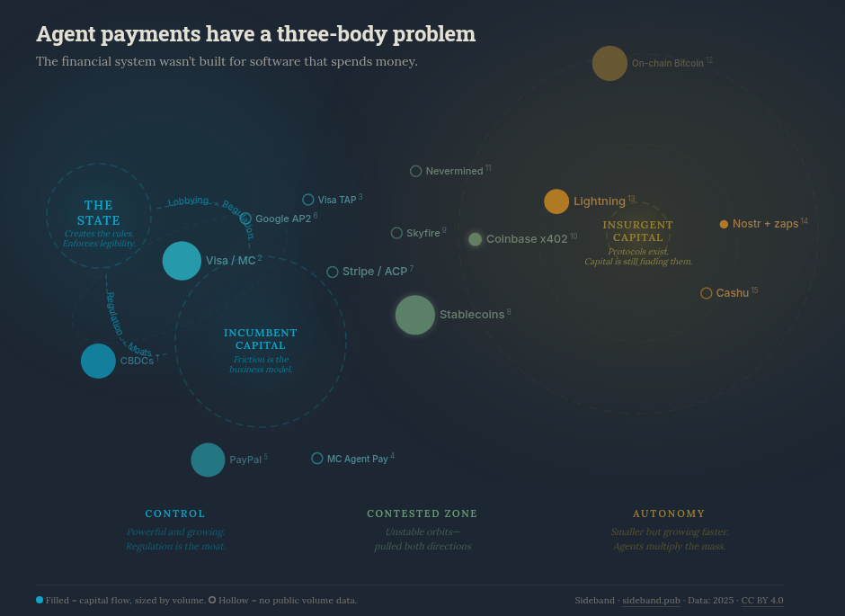

Visa launched its Trusted Agent Protocol last year—agents register public keys in a Visa-managed directory and cryptographically sign HTTP requests. MasterCard shipped Agent Pay with "Agentic Tokens," dynamic digital credentials built on existing tokenization infrastructure. PayPal integrated into ChatGPT so a human's wallet pays for things an agent recommends.

Read the fine print and it's the same system with an agent-shaped UI on top. The legal person is still in the loop. The compliance infrastructure is still intact. The moat is still there. This is what "agentic commerce" looks like when the incumbents build it—and it tells you everything about the political question underneath.

<!--more-->

How AI agents will pay for things gets framed as a technology problem, but the technology already exists across the full spectrum from Visa to Cashu. The unanswered question is political. There are three gravitational forces acting on every payment method an agent could use. Two of them are allied, and the third is growing faster than either of them expected.

## The binary system

The state and incumbent capital orbit each other in a tight, symbiotic loop.

The state creates regulation, which creates compliance requirements, which create barriers to entry, which create moats. Moats make incumbents profitable. Profitable incumbents fund lobbying. Lobbying creates more regulation.

Visa doesn't oppose financial regulation, Visa loves it. Every KYC check, every licensing requirement, every compliance burden is a wall that keeps competitors out. MasterCard, PayPal, the major banks, they all orbit in this same gravitational well. The friction isn't a bug in their business model, it is the business model.

The extreme version of this isn't regulation, it's the state becoming the payment rail itself. China's digital yuan can be programmed with expiration dates and spending restrictions, every transaction fully traceable. 119 countries are exploring CBDCs, with 60 in advanced development [^1]. The US banned them by executive order in January 2025, choosing stablecoins and incumbent intermediaries instead [^2]. That choice reveals the alliance: even the state prefers to work through incumbent capital rather than replace it, because replacing it means taking on the operational burden alone.

Incumbent capital has no reason to build payment infrastructure that doesn't require incumbent capital.

## The third body

On the other side of this field, a different kind of infrastructure exists: Lightning, Nostr, Cashu—protocols where an agent can generate a keypair, receive funds, and transact without a bank account, a legal entity, a corporate identity, or a human in the loop.

These protocols weren't built for agents. Lightning was built for fast, cheap Bitcoin transactions. Nostr was built for censorship-resistant social communication. Cashu was built for private, instant ecash. But they happen to have the exact properties autonomous agents need: permissionless access, programmable payments, instant settlement, and identity based on cryptography rather than legal documentation.

Lightning is the most agent-ready protocol with real volume: $14B annualized, 266% year-over-year growth, 8 million monthly transactions, sub-second settlement, sub-cent fees. Nostr zaps process 792K Lightning-native tips per day across 500K daily users. Cashu mints settle bearer tokens over Lightning—private, instant, no account required.

The incentive for capital to flow here is enormous. Agents that can transact autonomously are faster, cheaper, and scale without headcount. Every company deploying agent infrastructure eventually hits the payment wall: the agent can do everything except pay for things on its own.

But most of the money hasn't arrived yet. The protocols exist and the capital is still finding them. Most VCs writing checks for agent infrastructure have never heard of Cashu. Most enterprises evaluating agent deployments don't know that Lightning can settle a payment in milliseconds for a fraction of a cent. The gravity well is real, but the mass is still accumulating.

## The contested zone

Between the binary system and the third body sits a contested zone where orbits are unstable and everything is being pulled in two directions. It's crowded.

Stablecoins are the native currency of this zone. $33 trillion in transaction volume in 2025, up 72% year-over-year. Regulated money on permissionless rails—USDC is issued by a licensed entity (Circle), settled on Ethereum and Solana, and claimed by both sides. Visa settles in USDC on Solana. Coinbase's x402 protocol runs on USDC. Lightning bridges to stablecoins. The money itself is contested.

Coinbase built x402, an open protocol that uses HTTP 402 status codes to let agents pay for API access with USDC—$26.2M cumulative, 100M+ payments processed. The protocol is elegant and permissionless. But the money is regulated and the wallets are custodial, anchored to Coinbase's infrastructure. Open protocol, regulated money, institutional anchor.

Stripe and OpenAI co-developed the Agentic Commerce Protocol (ACP), an open standard enabling agents to browse, cart, and pay programmatically—live in ChatGPT, one line of code for existing Stripe merchants. Google launched Agent Payment Protocol 2.0 (AP2) with "IntentMandates" describing what an agent can buy, and adopted x402 as its crypto extension. Skyfire built "Know Your Agent" identity with signed JWTs, spend limits, and verified credentials—and completed a live transaction with Visa Intelligent Commerce. Nevermined is building agent billing infrastructure with ERC-8004 for agent identity, accepting both stablecoins and fiat.

Every one of them is making the same bet: that you can have enough autonomy to be useful to agents while maintaining enough legibility to satisfy regulators [^3].

All data and sources for the entities discussed here are documented in the [companion visualization](https://lab.sideband.pub/three-body-problem/).

## The hypothesis

Both gravitational fields are growing. The state is not static: regulatory scope, surveillance capability, and enforcement sophistication are all expanding, and the binary system's mass is increasing.

Insurgent capital is growing faster. Every new agent deployment, every new use case where autonomous software needs to pay for compute or data or services, adds mass to the other side. If agents are multiplicative—one deployment creating demand for many agent-to-agent transactions—then volume compounds while the state's compliance infrastructure scales linearly at best.

And agents break three assumptions that the entire compliance stack depends on:

**Speed.** KYC was designed for transactions at human speed. An agent making thousands of API calls per hour, each requiring a micropayment, cannot wait for identity verification. A compliance check that takes seconds is a hard blocker when the transaction loop runs in milliseconds.

**Volume.** The compliance stack processes human-scale throughput, a few transactions per person per day, while agent swarms generate millions per hour. No existing compliance infrastructure can run KYC at that rate, and scaling it linearly would cost more than the transactions are worth.

**Identity,** which is the deepest break. KYC assumes a legal person with a government ID, a physical address, a tax identification number. An agent has a keypair. The entire concept of "know your customer" presupposes that your customer is a human or a human-controlled legal entity, and when the customer is autonomous software, the question doesn't parse. Not a loophole in the regulatory framework but a category error in its foundations.

## The three-body problem

In physics, the three-body problem is famously unsolvable. There is no general closed-form solution for predicting the motion of three bodies interacting gravitationally. The system is chaotic, and small changes in initial conditions produce wildly different outcomes.

The state, incumbent capital, and insurgent capital are locked in a gravitational interaction where no stable equilibrium exists. The state will draw lines. Capital will route around them or lobby to move them. Protocols will be built, adopted, regulated, forked, rebuilt. The outcome depends on jurisdiction, on timing, on which specific enforcement actions happen first, on which protocols achieve adoption before regulators notice them.

The pull from the right is growing faster than the pull from the left. Not because the state is weak, but because agents are multiplicative. Every agent that needs to transact adds mass to the autonomy side. The state can add regulation, but regulation is additive. The incentive to build autonomous payment infrastructure is compounding.

The protocols that agents actually need already exist. They're permissionless, instant, programmable, and identity-free. They were built by people who weren't thinking about AI agents at all, for reasons that had nothing to do with artificial intelligence. But they solved the right problem anyway, because the right problem was never "how do we build payments for agents." The right problem was "how do we build payments that don't require a legal person."

Capital will flow toward them because the cost of not having autonomous agent payments will eventually exceed the cost of regulatory friction. The fight is over how much control the state retains on the way there, and that answer will be different in every jurisdiction on earth.

[^1]: [Central Bank Digital Currency Tracker](https://www.atlanticcouncil.org/cbdctracker/), Atlantic Council, 2025
[^2]: ["Fact Sheet: Executive Order to Establish United States Leadership in Digital Financial Technology"](https://www.whitehouse.gov/fact-sheets/2025/01/fact-sheet-executive-order-to-establish-united-states-leadership-in-digital-financial-technology/), The White House, Jan 2025
[^3]: James C. Scott, *Seeing Like a State* (1998). Scott's concept of legibility—the state's need to make populations and economies visible and categorizable before it can govern them—frames the fundamental tension here. Payment systems are legibility projects. The protocols agents need are illegibility by design.